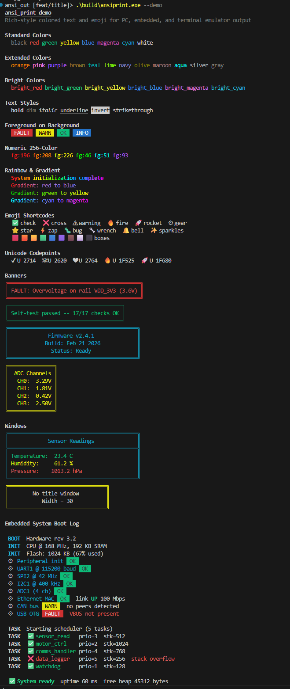

# `ansi_print`


A lightweight C library for colored terminal output using
[Python Rich](https://github.com/Textualize/rich)-inspired inline markup.
Built for embedded systems, CLI tools, and log formatting -- anywhere you want
readable, expressive colored text without pulling in a heavy framework. Ideally
used with a UTF-8 terminal for improved display of line based text, status, logs etc.

`ansi_print` borrows Rich's `[tag]` and `:emoji:` syntax but is deliberately
simple: it formats colored text, adds emojis. There is no markdown
rendering, and no nested markup stack. It outputs ANSI
escape codes through a caller-provided putc function, uses no dynamic
allocation, and compiles with any C99 toolchain.

Typical use cases:

- Embedded status displays over UART
- CLI tool output (errors, warnings, progress)
- Colorized log files and diagnostic messages
- Build system and test runner output

## Why Not Manually `#define RED "\033[31m"`?

A handful of escape macros is a perfectly good approach when all you need is a
few colors on a single platform. Use that for as long as it works. `ansi_print`
is for when those macros start turning into your own escape-code generator --
when you need mixed attributes like `[bold yellow on red]` instead of
`"\033[1;33;41m"`, runtime control so piped output stays clean, or features
like emoji and bar graphs that raw escapes become complex to manage.

What you get over hand-rolled macros:

- Readable mixed formatting with named tags
- Automatic reset management -- `[/]` closes whatever is open
- Global enable/disable with `NO_COLOR` and `isatty()` detection
- 28 named colors, 256-color palette, and text styles
- Emoji, Unicode escapes, gradients, banners, windows, and bar graphs
- Portable output via injected putc -- desktop, UART, USB CDC, any byte stream
- Compile-time feature flags so you only pay for what you use

## Terminal Output

Output of `ansiprint --demo`, the bundled CLI tool that showcases the main
features of the library: named colors, styles, backgrounds, gradients, emoji,
banners, windows, and bar graphs.



## Features

- Rich-style `[tag]` markup for colors, styles, and backgrounds
- Emoji shortcodes (`:name:` syntax, same as Python Rich)
- Unicode codepoint escapes (`:U-XXXX:` syntax)
- Rainbow and gradient text effects (24-bit true color)
- 8 standard + 12 extended + 8 bright named colors
- Banner boxes for single-call status messages (`ansi_banner()`)
- Streaming window boxes with titled headers (`ansi_window_start/line/end()`)
- Inline bar graphs with 1/8-cell resolution (`ansi_bar()`)
- Platform-independent output via injected function pointers
- No dynamic memory allocation (caller provides buffer)
- Compile-time feature toggles to minimize code/data size
- Windows console UTF-8 and ANSI escape support

## Limitations

- **UTF-8 terminal required.** Emoji, box-drawing, and bar graph characters are
  UTF-8 encoded. There is no ASCII fallback.
- **No tag nesting.** Tags are tracked by active state, not a stack. Opening
  `[red]` while `[cyan]` is active replaces cyan; closing `[/red]` does not
  restore cyan.
- **Not thread-safe.** Single static state -- intended for single-threaded or
  cooperative use. Wrap calls with a mutex if needed from multiple threads.
- **Single output stream.** One putc destination at a time. Call `ansi_init()`
  to switch targets, but only one is active.
- **Silent truncation.** Output longer than the caller-provided buffer is
  truncated with no error indication.

## Quick Start

```c
#include "ansi_print.h"

#ifdef ON_TERMINAL
#include <stdio.h>
static void my_putc(int ch)  { putchar(ch); }
static void my_flush(void)   { fflush(stdout); }
#else
static void my_putc(int ch)  { uart_putc((char)ch); }
static void my_flush(void)   { /* no flush needed */ }
#endif

static char buf[512];

int main(void)
{
    ansi_init(my_putc, my_flush, buf, sizeof(buf));
#ifdef ON_TERMINAL
    ansi_enable();  /* enables ANSI on Windows; no-op elsewhere */
#endif

    ansi_print("[bold red]Error:[/] file not found\n");
    ansi_print("[green]:check: All tests passed[/]\n");
    ansi_print("[yellow on black]Warning: %d retries[/]\n", 3);

    return 0;
}
```

## Integration

### Files

Copy these into your project:

| File               | Purpose                                  |
| ------------------ | ---------------------------------------- |
| `src/ansi_print.h` | Public API header                        |
| `src/ansi_print.c` | Implementation (single translation unit) |

### CMake

If your project uses CMake, you can add `ansi_print` as a subdirectory:

```cmake
add_subdirectory(ansi_print)
target_link_libraries(my_app PRIVATE ansi_print)
```

Or fetch it directly from a Git repository:

```cmake
include(FetchContent)
FetchContent_Declare(ansi_print
    GIT_REPOSITORY https://github.com/yourname/ansi_print.git
    GIT_TAG        v1.1.0
)
FetchContent_MakeAvailable(ansi_print)
target_link_libraries(my_app PRIVATE ansi_print)
```

Feature toggles work as CMake options:

```console
cmake -B build -DANSI_PRINT_MINIMAL=ON -DANSI_PRINT_BUILD_TESTS=ON
cmake --build build
ctest --test-dir build
```

### Embedded Setup

```c
/* UART output -- no flush needed */
static void uart_putc(int ch) { uart_put_char((char)ch); }
static char ansi_buf[256];

void app_init(void)
{
    ansi_init(uart_putc, NULL, ansi_buf, sizeof(ansi_buf));
}
```

### Suppressing Output

Pass `NULL` as the putc function to silently discard all output:

```c
ansi_init(NULL, NULL, buf, sizeof(buf));
```

### Single Instance

The library uses internal static state and supports one output stream at a time.
Call `ansi_init()` to reconfigure the output target (e.g. switch from UART to
USB), but only one destination is active at any moment. This is by design for
embedded systems where a single debug/status output is the norm.

## Configuration

Feature macros control what gets compiled in. By default everything is enabled.
Override them in one of two ways:

1. **app_cfg.h** -- Create this file on your include path. If it exists, the
   library includes it automatically before applying defaults.
2. **Compiler flags** -- Pass `-DANSI_PRINT_STYLES=0` etc. on the command line.

Define `ANSI_PRINT_NO_APP_CFG` to skip the `app_cfg.h` auto-include entirely.

### Minimal Build

Define `ANSI_PRINT_MINIMAL` to disable all optional features at once.
Individual flags can still be set to `1` to selectively re-enable features:

```c
/* app_cfg.h -- minimal build with just emoji */
#define ANSI_PRINT_MINIMAL
#define ANSI_PRINT_EMOJI  1
```

Or on the command line: `-DANSI_PRINT_MINIMAL`

### Feature Macros

| Macro                        | Default       | Controls                                            |
| ---------------------------- | ------------- | --------------------------------------------------- |
| `ANSI_PRINT_MINIMAL`         | (not defined) | When defined, all features below default to 0       |
| `ANSI_PRINT_EMOJI`           | 1             | Core emoji shortcodes (21 emoji)                    |
| `ANSI_PRINT_EXTENDED_EMOJI`  | 1             | Extended emoji set (~130 more)                      |
| `ANSI_PRINT_EXTENDED_COLORS` | 1             | 12 named colors (orange, pink, etc.)                |
| `ANSI_PRINT_BRIGHT_COLORS`   | 1             | 8 bright variants (bright_red, etc.)                |
| `ANSI_PRINT_STYLES`          | 1             | bold, dim, italic, underline, invert, strikethrough |
| `ANSI_PRINT_GRADIENTS`       | 1             | Rainbow and gradient effects, `ansi_rainbow()`      |
| `ANSI_PRINT_UNICODE`         | 1             | `:U-XXXX:` codepoint escapes                        |
| `ANSI_PRINT_BANNER`          | 1             | `ansi_banner()` boxed text output                   |
| `ANSI_PRINT_WINDOW`          | 1             | `ansi_window_start/line/end()` streaming boxed text |
| `ANSI_PRINT_BAR`             | 1             | `ansi_bar()` inline horizontal bar graphs           |

### Example app_cfg.h (minimal embedded build)

```c
/* app_cfg.h -- 8 standard colors only, minimal code/data footprint */
#define ANSI_PRINT_MINIMAL
```

## Markup Syntax

### Colors (foreground)

```c
ansi_print("[red]Error message[/]\n");
ansi_print("[cyan]Info: %s[/]\n", msg);
```

### Backgrounds

Use the `on` keyword:

```c
ansi_print("[white on red]CRITICAL[/]\n");
ansi_print("[black on yellow]Warning[/]\n");
```

### Styles

```c
ansi_print("[bold]Important[/]\n");
ansi_print("[dim italic]Fine print[/]\n");
ansi_print("[underline]Underlined[/]\n");
ansi_print("[strikethrough]Deprecated[/]\n");
ansi_print("[invert]Inverted[/]\n");
```

### Combined

```c
ansi_print("[bold yellow on black]System Status: %s[/]\n", status);
```

### Close Tags

| Tag               | Behavior                                 |
| ----------------- | ---------------------------------------- |
| `[/]`             | Reset all formatting                     |
| `[/red]`          | Close only red foreground                |
| `[/bold]`         | Close only bold style                    |
| `[/red on black]` | Close specific foreground and background |

Selective close removes only the named attribute; other active formatting
remains. This matches Python Rich behavior.

```c
/* Bold stays active after closing green */
ansi_print("[bold][green]OK[/green] still bold[/bold]\n");
```

### Default Colors

`ansi_set_fg()` and `ansi_set_bg()` set baseline colors that are restored
whenever `[/]` resets formatting or a selective close removes the active color.
This is useful for applications that run with a fixed color scheme.

```c
ansi_set_fg("white");
ansi_set_bg("blue");
ansi_print("[red]Error:[/] back to white on blue\n");
ansi_print("[bold]Bold[/] still white on blue\n");

ansi_set_fg(NULL);  /* clear -- [/] reverts to terminal default */
```

### Escaped Characters

| Sequence | Output                                      |
| -------- | ------------------------------------------- |
| `[[`     | Literal `[`                                 |
| `]]`     | Literal `]`                                 |
| `::`     | Literal `:` (when emoji or unicode enabled) |

### Numeric Colors (256-color palette)

```c
ansi_print("[fg:208]Orange text[/]\n");      /* foreground */
ansi_print("[fg:82 bg:236]Custom[/]\n");     /* fg + bg */
```

### Important: No Tag Nesting

Tags are tracked by active state, not a stack. Opening a new color replaces the
previous one -- closing it does not restore the earlier color.

```c
/* This does NOT work as expected: */
ansi_print("[cyan]Outer [red]inner[/red] NOT cyan here[/cyan]\n");

/* Workaround -- close and reopen: */
ansi_print("[cyan]Before [/cyan][red]middle[/red][cyan] after[/cyan]\n");
```

## Colors

### Standard (always available)

| Name    | Foreground  | Background         |
| ------- | ----------- | ------------------ |
| black   | `[black]`   | `[... on black]`   |
| red     | `[red]`     | `[... on red]`     |
| green   | `[green]`   | `[... on green]`   |
| yellow  | `[yellow]`  | `[... on yellow]`  |
| blue    | `[blue]`    | `[... on blue]`    |
| magenta | `[magenta]` | `[... on magenta]` |
| cyan    | `[cyan]`    | `[... on cyan]`    |
| white   | `[white]`   | `[... on white]`   |

### Extended (ANSI_PRINT_EXTENDED_COLORS)

orange, pink, purple, brown, teal, lime, navy, olive, maroon, aqua, silver, gray

### Bright (ANSI_PRINT_BRIGHT_COLORS)

bright_black, bright_red, bright_green, bright_yellow, bright_blue,
bright_magenta, bright_cyan, bright_white

## Styles (ANSI_PRINT_STYLES)

| Name          | Effect                         |
| ------------- | ------------------------------ |
| bold          | Bold / bright text             |
| dim           | Reduced brightness             |
| italic        | Italic text                    |
| underline     | Underlined text                |
| invert        | Swap foreground and background |
| strikethrough | Struck-through text            |

## Special Effects (ANSI_PRINT_GRADIENTS)

### Rainbow

Each visible character cycles through a 21-step color palette:

```c
ansi_print("[rainbow]Hello, Rainbow![/]\n");
ansi_print("[bold rainbow]Bold rainbow[/]\n");

/* Or use the dedicated function: */
ansi_rainbow("Direct rainbow output\n");
```

### Gradient

Per-character interpolation between two named colors using 24-bit true color:

```c
ansi_print("[gradient red blue]Smooth transition[/gradient]\n");
ansi_print("[bold][gradient cyan magenta]Styled gradient[/gradient][/bold]\n");
```

## Emoji (ANSI_PRINT_EMOJI)

Emoji use Rich-style `:name:` shortcodes. They emit Unicode characters (not
ANSI codes) so they appear even when color is disabled.

```c
ansi_print(":check: [green]Tests passed[/]\n");
ansi_print(":warning: [yellow]Low memory[/]\n");
ansi_print(":cross: [red]Build failed[/]\n");
```

### Core Emoji (21)

| Shortcode       | Emoji | Shortcode     | Emoji | Shortcode     | Emoji |
| --------------- | ----- | ------------- | ----- | ------------- | ----- |
| `:check:`       | ✅     | `:cross:`     | ❌     | `:warning:`   | ⚠     |
| `:info:`        | ℹ     | `:arrow:`     | ➡     | `:gear:`      | ⚙     |
| `:clock:`       | ⏰     | `:hourglass:` | ⌛     | `:thumbs_up:` | 👍     |
| `:thumbs_down:` | 👎     | `:star:`      | ⭐     | `:fire:`      | 🔥     |
| `:rocket:`      | 🚀     | `:zap:`       | ⚡     | `:bug:`       | 🐛     |
| `:wrench:`      | 🔧     | `:bell:`      | 🔔     | `:sparkles:`  | ✨     |
| `:package:`     | 📦     | `:link:`      | 🔗     | `:stop:`      | 🛑     |

### Extended Emoji (ANSI_PRINT_EXTENDED_EMOJI, ~140 more)

| Category      | Examples                                                                                          |
| ------------- | ------------------------------------------------------------------------------------------------- |
| Faces         | smile, grin, laugh, wink, cool, thinking, cry, skull                                              |
| Hands         | wave, clap, pray, muscle, ok_hand, victory, point_up                                              |
| Symbols       | heart, broken_heart, question, exclamation, infinity, recycle                                     |
| Arrows        | arrow_up, arrow_down, arrow_left, arrow_right, refresh                                            |
| Objects       | key, lock, unlock, shield, hammer, scissors, pencil, clipboard                                    |
| Nature        | sun, moon, cloud, rain, snow, earth, tree, flower                                                 |
| Food          | coffee, beer, pizza, cake, apple                                                                  |
| Animals       | dog, cat, snake, bird, fish, butterfly, bee, unicorn                                              |
| Transport     | car, airplane, ship, bicycle, train, fuel                                                         |
| Awards        | trophy, medal, crown, gem, money, gift, party, confetti                                           |
| Media         | music, film, camera, art, microphone                                                              |
| Colored Boxes | red_box, orange_box, yellow_box, green_box, blue_box, purple_box, brown_box, white_box, black_box |
| Misc          | pin, paperclip, eye, bulb, battery, plug, satellite, flag, memo                                   |

Unknown `:names:` pass through as literal text.

## Unicode Codepoint Escapes (ANSI_PRINT_UNICODE)

Insert any Unicode character by codepoint using `:U-XXXX:` syntax, where
`XXXX` is 1-6 hex digits (case-insensitive). Supports the full Unicode range
U+0001 to U+10FFFF.

```c
ansi_print(":U-2714: done\n");         // ✔ done
ansi_print(":U-1F525: on fire\n");     // 🔥 on fire
ansi_print(":U-41:\n");                // A
ansi_print(":U-2603: snowman\n");      // ☃ snowman
```

Like emoji, Unicode escapes are content -- they are always emitted regardless of
the color enable/disable state. Invalid codepoints (no hex digits, out of range)
pass through as literal text.

## Banner (ANSI_PRINT_BANNER)

`ansi_banner()` draws a Unicode double-line box around printf-formatted text,
with the border and text rendered in a named color. All text is formatted into
the shared buffer in a single call, so the total content is limited by the
buffer size passed to `ansi_init()`. Because the full text is available up
front, `width=0` can auto-size to the longest line. The `align` argument
controls text alignment within the box.

```c
typedef enum {
    ANSI_ALIGN_LEFT,    /* Left-align text (default) */
    ANSI_ALIGN_CENTER,  /* Center text within the box */
    ANSI_ALIGN_RIGHT    /* Right-align text within the box */
} ansi_align_t;
```

```c
/* Auto-width, left-aligned single line */
ansi_banner("red", 0, ANSI_ALIGN_LEFT,
            "Error: file %s not found", filename);

/* Fixed-width, centered multi-line */
ansi_banner("cyan", 40, ANSI_ALIGN_CENTER,
            "Firmware v%d.%d.%d\n"
            "Build: %s\n"
            "Status: %s",
            2, 4, 1, "Feb 21 2026", "Ready");

/* Right-aligned */
ansi_banner("yellow", 0, ANSI_ALIGN_RIGHT,
            "ADC Channels\n"
            "  CH0: %5.2fV\n"
            "  CH1: %5.2fV",
            3.29, 1.81);
```

*Centered banner (rendered in the specified color):*

```text
╔══════════════════════════════════════════╗
║          Firmware v2.4.1                 ║
║          Build: Feb 21 2026              ║
║          Status: Ready                   ║
╚══════════════════════════════════════════╝
```

Lines longer than the specified width are truncated; shorter lines are padded
according to the alignment setting. Any color name from the standard, extended,
or bright tables can be used. An unknown or NULL color produces an uncolored box.

## Window (ANSI_PRINT_WINDOW)

A streaming box API for displaying boxed text with an optional titled header.
Unlike `ansi_banner()`, which formats all text into the buffer at once, windows
are built one line at a time -- each `ansi_window_line()` call formats and
emits a single row. This means the number of lines is unlimited (not
constrained by the buffer size), though each individual line must still fit in
the buffer. The trade-off is that `width` must be specified up front since the
full text is not available for auto-sizing.

The border color is set once via `ansi_window_start()` and applied to all
border characters (top, bottom, separator, and side `║` bars). Line text
supports full Rich markup — colors, styles, emoji, gradients — the same tag
syntax as `ansi_print()`. Width and padding are calculated from visible
character count, so markup tags and ANSI codes do not affect alignment.

```c
/* Window with cyan borders and per-line markup */
ansi_window_start("cyan", 40, ANSI_ALIGN_CENTER, "Sensor Readings");
ansi_window_line(ANSI_ALIGN_LEFT, "[green]Temperature: %5.1f C[/]", 23.4);
ansi_window_line(ANSI_ALIGN_LEFT, "[yellow]Humidity:    %5.1f %%[/]", 61.2);
ansi_window_line(ANSI_ALIGN_LEFT, "[red]Pressure:    %5.1f hPa[/]", 1013.2);
ansi_window_end();

/* Window without a title */
ansi_window_start("yellow", 30, ANSI_ALIGN_LEFT, NULL);
ansi_window_line(ANSI_ALIGN_CENTER, "Centered content");
ansi_window_line(ANSI_ALIGN_RIGHT, "Right-aligned: %d", 42);
ansi_window_end();
```

*Window with title and separator:*

```text
╔══════════════════════════════════════════╗
║           Sensor Readings                ║
╠══════════════════════════════════════════╣
║ Temperature:  23.4 C                     ║
║ Humidity:     61.2 %                     ║
║ Pressure:  1013.2 hPa                    ║
╚══════════════════════════════════════════╝
```

The title line appears only when a non-NULL, non-empty title is passed to
`ansi_window_start()`. A horizontal separator (`╠═══╣`) is drawn beneath the
title. Each `ansi_window_line()` call has its own alignment parameter.

## Bar Graph (ANSI_PRINT_BAR)

`ansi_bar()` builds a string of Unicode block characters representing a
horizontal bar graph into a caller-provided buffer. The string contains Rich
markup for coloring and can be used as a `%s` argument to `ansi_print()`,
`ansi_window_line()`, or any printf-style function.

Each character cell has 8 sub-steps of resolution using partial block elements
(█▉▊▋▌▍▎▏). The `track` parameter selects the character used for unfilled
cells.

```c
const char *ansi_bar(char *buf, size_t buf_size,
                     const char *color, int width, ansi_bar_track_t track,
                     double value, double min, double max);
```

- `buf`, `buf_size` -- caller-provided output buffer (128 bytes supports ~30-wide bars)
- `color` -- named color for the filled portion (NULL for uncolored)
- `width` -- total bar width in character cells
- `track` -- character for unfilled cells (see table below)
- `value` -- current value to display
- `min`, `max` -- range for scaling (float math, clamped)

### Track Characters

| Value            | Character | Description      |
| ---------------- | --------- | ---------------- |
| `ANSI_BAR_BLANK` | (space)   | No visible track |
| `ANSI_BAR_LIGHT` | ░         | Light shade      |
| `ANSI_BAR_MED`   | ▒         | Medium shade     |
| `ANSI_BAR_HEAVY` | ▓         | Dark shade       |
| `ANSI_BAR_DOT`   | ·         | Middle dot       |
| `ANSI_BAR_LINE`  | ─         | Horizontal line  |

The buffer is passed directly (not via an init function) so that multiple bars
can coexist in the same printf argument list -- each call writes to its own
buffer with no shared state.

```c
/* Single bar with light shade track */
char bar[128];
ansi_print("CPU: %s %d%%\n",
           ansi_bar(bar, sizeof(bar), "green", 20,
                    ANSI_BAR_LIGHT, cpu, 0, 100), cpu);

/* Clean look with no visible track */
ansi_print("CPU: %s %d%%\n",
           ansi_bar(bar, sizeof(bar), "green", 20,
                    ANSI_BAR_BLANK, cpu, 0, 100), cpu);

/* Two bars in one printf -- each gets its own buffer */
char b1[128], b2[128];
ansi_print("CPU %s  MEM %s\n",
           ansi_bar(b1, sizeof(b1), "green", 15,
                    ANSI_BAR_LIGHT, cpu, 0, 100),
           ansi_bar(b2, sizeof(b2), "cyan",  15,
                    ANSI_BAR_LIGHT, mem, 0, 100));

/* Inside a window */
ansi_window_start("cyan", 30, ANSI_ALIGN_LEFT, "Monitors");
ansi_window_line(ANSI_ALIGN_LEFT, "CPU %s %d%%",
                 ansi_bar(bar, sizeof(bar), "green", 15,
                          ANSI_BAR_LIGHT, 73, 0, 100), 73);
ansi_window_line(ANSI_ALIGN_LEFT, "MEM %s %d%%",
                 ansi_bar(bar, sizeof(bar), "cyan",  15,
                          ANSI_BAR_LIGHT, 45, 0, 100), 45);
ansi_window_end();
```

*Bar graphs with light-shade track:*

```text
CPU: ██████████████▌░░░░░ 73%
MEM: █████████░░░░░░░░░░░ 45%
```

### Percentage Shorthand

`ansi_bar_percent()` is a convenience wrapper with a fixed 0-100 range that
appends " XX%" after the bar:

```c
char bar[128];
ansi_print("CPU %s\n",
           ansi_bar_percent(bar, sizeof(bar), "green", 20,
                            ANSI_BAR_LIGHT, 73));
// Output: CPU ██████████████▌░░░░░ 73%
```

## API Reference

```c
/* Initialize -- must be called first */
void ansi_init(ansi_putc_function putc_fn, ansi_flush_function flush_fn,
               char *buf, size_t buf_size);

/* Enable ANSI on Windows console, detect NO_COLOR and isatty */
void ansi_enable(void);

/* Color enable/disable */
void ansi_set_enabled(int enabled);
int  ansi_is_enabled(void);
void ansi_toggle(void);

/* Default foreground/background (restored on [/] reset) */
void ansi_set_fg(const char *color);
void ansi_set_bg(const char *color);

/* Rich-style printf with [tag] markup */
void ansi_print(const char *fmt, ...);

/* Printf into buffer without emitting -- returns formatted string */
const char *ansi_format(const char *fmt, ...);

/* Rich-style output for static strings (no printf overhead) */
void ansi_puts(const char *s);

/* Direct rainbow output (ANSI_PRINT_GRADIENTS only) */
void ansi_rainbow(const char *s);

/* Colored banner box around text (ANSI_PRINT_BANNER only) */
void ansi_banner(const char *color, int width, ansi_align_t align,
                 const char *fmt, ...);

/* Streaming boxed text with optional title (ANSI_PRINT_WINDOW only) */
void ansi_window_start(const char *color, int width, ansi_align_t align,
                       const char *title);
void ansi_window_line(ansi_align_t align, const char *fmt, ...);
void ansi_window_end(void);

/* Inline bar graph string (ANSI_PRINT_BAR only) */
const char *ansi_bar(char *buf, size_t buf_size,
                     const char *color, int width, ansi_bar_track_t track,
                     double value, double min, double max);

/* Bar graph with " XX%" appended (ANSI_PRINT_BAR only) */
const char *ansi_bar_percent(char *buf, size_t buf_size,
                             const char *color, int width,
                             ansi_bar_track_t track, int percent);
```

## CLI Tool

The project includes a command-line tool for testing markup from the shell.

### Build

```console
make ansiprint
```

### Usage

```console
ansiprint [--demo] [<markup string> ...]
```

### Feature Demo

Run `ansiprint --demo` to see all features in action (output shown at top of this page).

### Examples

```console
$ ansiprint "[bold red]Error:[/] something broke"
Error: something broke

$ ansiprint "[green]:check: All tests passed[/]"
✅ All tests passed

$ ansiprint ":warning: [yellow]Low memory[/]"
⚠ Low memory

$ ansiprint "[white on red] CRITICAL [/] system overheating"
 CRITICAL  system overheating

$ ansiprint "[bold][gradient red blue]Smooth gradient text[/gradient][/bold]"
Smooth gradient text

$ ansiprint ":fire::fire::fire: [bold red]ALERT[/] :fire::fire::fire:"
🔥🔥🔥 ALERT 🔥🔥🔥

$ ansiprint ":green_box: Pass  :red_box: Fail"
🟩 Pass  🟥 Fail

$ ansiprint ":U-2714: done  :U-1F525: hot"
✔ done  🔥 hot

$ ansiprint "[bold rainbow]Rainbow text![/]"
Rainbow text!
```

Note: colors and styles render in the terminal but are shown as plain text above.

## Building & Testing

### Prerequisites

- C99 compiler (gcc, clang, MSVC)
- Make (GNU Make on Linux/macOS, MSYS2 on Windows)

### Targets

| Target              | Description                                  |
| ------------------- | -------------------------------------------- |
| `make all`          | Build CLI tool, run tests, and generate docs |
| `make ansiprint`    | Build CLI executable only                    |
| `make test`         | Build and run tests (all features enabled)   |
| `make test-minimal` | Build and run tests (all features disabled)  |
| `make docs`         | Generate Doxygen HTML documentation          |
| `make clean`        | Remove build artifacts (including docs)      |

### Test Output

Tests print a config banner showing which features are active:

```console
$ make test
>> build/test_cprint
Build config: EMOJI=1 EXTENDED_EMOJI=1 EXTENDED_COLORS=1 BRIGHT_COLORS=1 STYLES=1 GRADIENTS=1 UNICODE=1 BANNER=1 WINDOW=1 BAR=1
test/test_cprint.c:883:test_plain_text_no_tags:PASS
test/test_cprint.c:884:test_printf_formatting:PASS
...
118 Tests 0 Failures 0 Ignored

$ make test-minimal
>> build/test_cprint_minimal
Build config: EMOJI=0 EXTENDED_EMOJI=0 EXTENDED_COLORS=0 BRIGHT_COLORS=0 STYLES=0 GRADIENTS=0 UNICODE=0 BANNER=0 WINDOW=0 BAR=0
test/test_cprint.c:883:test_plain_text_no_tags:PASS
...
42 Tests 0 Failures 0 Ignored
```

The minimal build runs fewer tests (features compiled out) plus additional
tests that verify compiled-out features degrade gracefully (unknown tags
consumed silently, emoji shortcodes pass through as literal text, etc.).

## License

MIT
